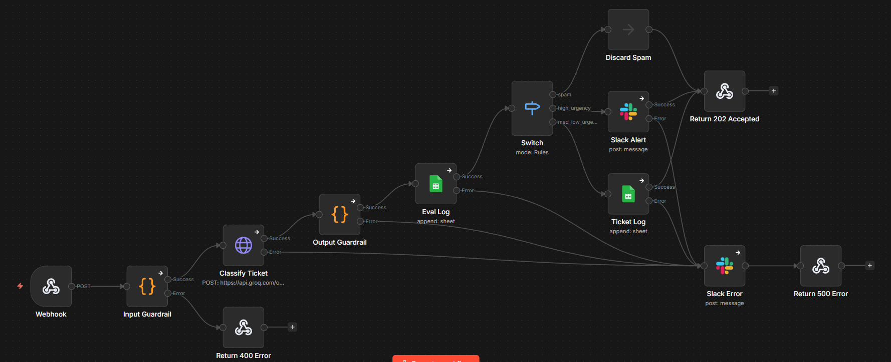

# AI-Powered Support Ticket Triage

    

*Keyword matching breaks on language nuance. This system uses an LLM to reason about the full message context — extracting urgency, category, confidence, and reasoning from every incoming ticket, then routing and logging each decision for human review and accuracy measurement over time.*

Built as a portfolio project to demonstrate AI-powered automation architecture in a B2B support context. Designed to be reproducible — any team running n8n self-hosted can deploy this in under 30 minutes.

---

## Table of contents

- [What it does](#what-it-does)
- [Why AI — not keyword matching](#why-ai--not-keyword-matching)
- [Classification schema](#classification-schema)
- [What happens when the AI is wrong or uncertain](#what-happens-when-the-ai-is-wrong-or-uncertain)
- [How accuracy is measured](#how-accuracy-is-measured)
- [Architecture](#architecture)
- [Tech stack](#tech-stack)
- [Prerequisites](#prerequisites)
- [Environment variables](#environment-variables)
- [Local setup](#local-setup)
- [Testing the webhook](#testing-the-webhook)
- [Known limitations](#known-limitations)
- [Roadmap](#roadmap)

---

## What it does

1. **Receives** an incoming support ticket via HTTP POST (webhook)
2. **Validates** the payload — blocks incomplete, too-short, or injection-attempt messages before they reach the AI
3. **Classifies** the ticket using Groq's `llama-3.3-70b-versatile` model, extracting urgency, category, confidence score, and reasoning
4. **Validates** the AI output — rejects malformed or out-of-schema responses before they reach any destination
5. **Routes** the ticket based on classification:
   - `spam` → discarded immediately
   - `high urgency` → Slack alert to `#alerts`
   - `medium / low urgency` → appended to Google Sheets ticket log
6. **Logs** every valid classification to a dedicated eval sheet for human review and accuracy tracking
7. **Notifies** `#errors` on Slack with error details and execution link on any system failure

---

## Why AI — not keyword matching

Keyword matching can catch "refund" or "crash", but it breaks on phrasing variations, mixed signals, and language nuance. A ticket saying *"I think there might be an issue with my invoice from last month"* doesn't contain any urgency keyword — but it's a billing issue that may need immediate attention depending on context.

This system uses an LLM to reason about the full message context before assigning urgency and category — not just detect keywords. The model returns a `reasoning` field explaining its decision, logged for human review alongside every classification.

The prompt enforces a strict output schema to keep the model's behavior deterministic and auditable. This means two things: the model is instructed to use only fixed, predefined values for each field — it cannot invent new urgency levels or categories. And the temperature is set to `0.1`, a parameter that controls how "creative" the model is in its responses. At `0.1`, the model stays close to the most predictable output, reducing variation between runs. Together, these constraints make the system's behavior consistent and easier to audit over time.

---

## Classification schema

The model returns a structured JSON object for every ticket. All field values are fixed — the model cannot invent new ones.

| Field | Type | Valid values |
|---|---|---|
| `urgency` | string | `high` · `medium` · `low` |
| `category` | string | `billing` · `technical` · `account` · `spam` · `other` |
| `confidence` | float | `0.0` – `1.0` |
| `reasoning` | string | Free text — model's explanation of the decision |

**On `confidence`:** this score is self-reported by the model via prompt instructions — it is not mathematically derived from token probabilities (Groq does not currently support logprobs). It is used as an indicator for human review prioritization, not as a guarantee of correctness.

**On `reasoning`:** logged to the eval sheet on every execution — available for human review alongside the AI classification.

---

## What happens when the AI is wrong or uncertain

Two mechanisms handle this:

**Low confidence flag**
If the model's self-reported confidence score is below `0.6`, the ticket is still processed normally — but it's logged to the eval sheet with `low_confidence_flag = TRUE`. This flags it for priority human review. Low-confidence tickets are the most valuable segment for accuracy analysis because they reveal where the model struggles.

**Output guardrail**
If the model returns a malformed JSON, an urgency value outside the allowed list, or a category that doesn't match the schema, the response is rejected entirely. The ticket never reaches any destination, `#errors` is notified, and the caller receives a `500`. These are treated as technical failures, not classification errors — they never reach the eval log.

See [`docs/ai-ticket-triage-flowchart.md`](docs/ai-ticket-triage-flowchart.md) for the complete decision tree across all paths.

---

## How accuracy is measured

Every valid AI classification is logged to a `eval_log` tab in Google Sheets. Each row captures:

| Field | Description |
|---|---|
| `ai_urgency` / `ai_category` | Model's classification |
| `confidence` | Self-reported confidence (0.0–1.0) |
| `reasoning` | Model's explanation of the decision |
| `low_confidence_flag` | TRUE if confidence < 0.6 |
| `human_label_urgency` / `human_label_category` | Filled manually by a reviewer |

A separate `eval_summary` tab aggregates accuracy metrics automatically using SUMPRODUCT formulas:

| Metric | Description |
|---|---|
| `total_executions` | Total tickets that reached the eval log |
| `total_reviewed` | Tickets with human labels filled in |
| `total_correct` | Classifications where AI matched human label |
| `accuracy_pct` | `total_correct / total_reviewed` |
| `low_confidence_count` | Tickets flagged with `low_confidence_flag = TRUE` |
| `low_confidence_pct` | `low_confidence_count / total_executions` |

Acceptance threshold: system is considered stable at ≥ 85% accuracy over the last 50 reviewed tickets.

This is a human-in-the-loop design by intent: the eval pipeline exists specifically to measure AI quality over time, not just to log operations.

---

## Architecture

```
Incoming HTTP POST (webhook)
         │
         ▼
[Input Guardrail] — validate payload, block injection
 ✗ → 400 Bad Request
         │
         ▼
[Groq API — Classification]
 → urgency · category · confidence · reasoning
 ✗ → Slack #errors · 500
         │
         ▼
[Output Guardrail] — validate schema, check values
 ✗ → Slack #errors · 500
 ⚠ confidence < 0.6 → low_confidence_flag = TRUE
         │
         ▼
[Eval Log — Google Sheets]
 All valid classifications logged here for human review
         │
         ▼
[Routing — Switch]
 ├── spam       → Discard
 ├── high       → Slack #alerts
 └── medium/low → Google Sheets ticket log
         │
         ▼
[Return 202 Accepted]
```



For detailed diagrams:
- [System architecture](docs/ai-ticket-triage-architecture.md) — components and technology choices
- [Flowchart](docs/ai-ticket-triage-flowchart.md) — all validation and routing paths
- [Sequence diagram](docs/ai-ticket-triage-sequence-diagram.md) — message flow between systems

---

## Tech stack

| Layer | Tool |
|---|---|
| Workflow orchestration | [n8n](https://n8n.io/) (self-hosted via Docker) |
| AI classification | [Groq API](https://console.groq.com/) — `llama-3.3-70b-versatile` |
| Alert destination | Slack (Bot Token, `chat:write` scope) |
| Data destination | Google Sheets (Service Account) |
| Environment | Docker + Docker Compose |
| Entry point | Webhook (HTTP POST) |

---

## Prerequisites

- [Docker](https://docs.docker.com/get-docker/) and [Docker Compose](https://docs.docker.com/compose/) installed
- [Groq API key](https://console.groq.com/) (free tier is sufficient)
- Slack workspace with a Bot Token — scopes required: `chat:write`; bot must be invited to `#alerts` and `#errors` channels
- Google Sheets spreadsheet with three tabs: `eval_log`, `ticket_log`, and `eval_summary` (column headers and metrics in setup section below)
- Google Cloud Service Account with editor access to the spreadsheet — JSON key file downloaded

---

## Environment variables

Copy `.env.example` to `.env` and fill in all values before running:

```bash
cp .env.example .env
```

| Variable | Description |
|---|---|
| `N8N_ENCRYPTION_KEY` | Random 32-char hex string used by n8n to encrypt credentials |
| `N8N_HOST` | Host where n8n is running (e.g. `localhost`) |
| `GROQ_API_KEY` | Groq API key |
| `GOOGLE_SERVICE_ACCOUNT_EMAIL` | Service account email with editor access to the spreadsheet |
| `SLACK_BOT_TOKEN` | Slack Bot Token (starts with `xoxb-`) |

Never commit `.env` to version control — `.gitignore` already excludes it.

---

## Local setup

**1. Clone the repository**

```bash
git clone https://github.com/MateusGarciaDev/ai-ticket-triage.git
cd ai-ticket-triage
```

**2. Configure environment variables**

```bash
cp .env.example .env
# Edit .env with your credentials
```

**3. Start n8n**

```bash
docker-compose up -d
```

n8n will be available at `http://localhost:5678`.

**4. Import the workflow**

- Open n8n at `http://localhost:5678`
- Go to **Workflows → Import from file**
- Select `workflow/ai-ticket-triage-n8n-workflow.json`

**5. Configure credentials in n8n**

In the n8n UI, open the workflow and configure credentials for each service:
- **Groq**: HTTP Request node → Header Auth with `Authorization: Bearer YOUR_GROQ_API_KEY`
- **Slack**: Slack nodes → Slack Bot Token credential
- **Google Sheets**: Google Sheets nodes → Service Account credential

**6. Set up Google Sheets**

Create a spreadsheet with the following three tabs:

`eval_log` tab headers:
```
timestamp | ticket_id | message_preview | ai_urgency | ai_category | confidence | reasoning | low_confidence_flag | human_label_urgency | human_label_category
```

`ticket_log` tab headers:
```
timestamp | ticket_id | name | email | message | ai_urgency | ai_category | confidence
```

`eval_summary` tab columns:
```
metric | value
```

Populate the `metric` column manually with the following rows (values are calculated automatically via formula):
```
total_executions
total_reviewed
total_correct
accuracy_pct
low_confidence_count
low_confidence_pct
```

**7. Activate the workflow**

Toggle the workflow to **Active**. The webhook URL will be displayed on the Webhook node — use it to send test requests.

---

## Testing the webhook

An Insomnia collection with pre-configured requests for all test scenarios is available at `insomnia/ai-ticket-triage.json`. Import it directly into [Insomnia](https://insomnia.rest/) and update the `base_url` environment variable to your webhook URL.

Alternatively, send a test ticket using cURL:

```bash
curl -X POST YOUR_WEBHOOK_URL \
  -H "Content-Type: application/json" \
  -d '{
    "name": "Ana Lima",
    "email": "ana@example.com",
    "message": "I was charged twice this month and my account is now suspended. I need this fixed immediately."
  }'
```

Expected response: `202 Accepted`

Expected behavior: ticket classified as `billing / high`, Slack alert sent to `#alerts`, row logged in `eval_log`.

---

## Known limitations

These are known trade-offs in the current implementation, documented for transparency. None of them affect the core triage flow under normal operating conditions.

- Prompt injection detection uses basic regex patterns — covers explicit English-language attacks only
- `confidence` score is self-reported by the model via prompt (Groq does not support logprobs)
- No retry logic for failed API calls
- No webhook authentication (HMAC signature validation)
- Google Sheets human label columns use free-text input — no dropdown validation

---

## Roadmap

- Prompt engineering with labeled examples to improve urgency classification accuracy
- Google Sheets dropdown validation for human label columns
- Advanced prompt injection detection (multilingual, obfuscated patterns)
- Retry logic for failed API calls
- Webhook authentication via HMAC signature
- Formal UUID for `ticket_id` (currently timestamp-based)
- Automated eval — programmatic AI vs human label comparison
- Dashboard UI for `eval_summary` visualization

---

## License

MIT
