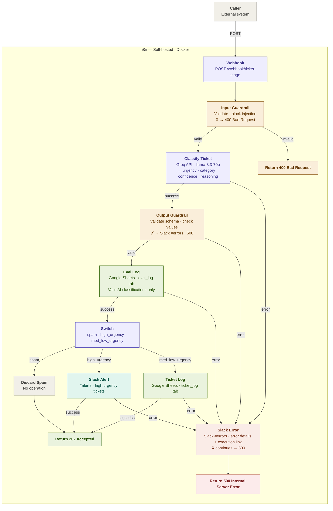

# System Architecture — AI-Powered Support Ticket Triage

```mermaid
%%{init: {'flowchart': {'rankSpacing': 80}}}%%
flowchart TD
    caller["`**Caller**
    External system`"]

    subgraph n8n["n8n — Self-hosted · Docker"]
        webhook["`**Webhook**
        POST /webhook/ticket-triage`"]
        input_g["`**Input Guardrail**
        Validate · block injection
        ✗ → 400 Bad Request`"]
        groq_call["`**Classify Ticket**
        Groq API · llama-3.3-70b
        → urgency · category · confidence · reasoning`"]
        output_g["`**Output Guardrail**
        Validate schema · check values
        ✗ → Slack #errors · 500`"]
        eval_log["`**Eval Log**
        Google Sheets · eval_log tab
        Valid AI classifications only`"]
        routing["`**Switch**
        spam · high_urgency · med_low_urgency`"]
        slack_alert["`**Slack Alert**
        #alerts · high urgency tickets`"]
        ticket_log["`**Ticket Log**
        Google Sheets · ticket_log tab`"]
        discard["`**Discard Spam**
        No operation`"]
        slack_error["`**Slack Error**
        Slack #errors · error details + execution link
        ✗ continues → 500`"]
        r202["`**Return 202 Accepted**`"]
        r400["`**Return 400 Bad Request**`"]
        r500["`**Return 500 Internal Server Error**`"]

        webhook --> input_g
        input_g -->|valid| groq_call
        input_g -->|invalid| r400
        groq_call -->|success| output_g
        output_g -->|valid| eval_log
        eval_log -->|success| routing
        routing -->|spam| discard
        routing -->|high_urgency| slack_alert
        routing -->|med_low_urgency| ticket_log
        discard --> r202
        slack_alert -->|success| r202
        ticket_log -->|success| r202
        groq_call -->|error| slack_error
        output_g -->|error| slack_error
        eval_log -->|error| slack_error
        slack_alert -->|error| slack_error
        ticket_log -->|error| slack_error
        slack_error --> r500
    end

    caller -->|POST| webhook

    style caller fill:#F1EFE8,stroke:#5F5E5A,color:#444441
    style webhook fill:#EEEDFE,stroke:#534AB7,color:#3C3489
    style input_g fill:#FAEEDA,stroke:#854F0B,color:#633806
    style groq_call fill:#EEEDFE,stroke:#534AB7,color:#3C3489
    style output_g fill:#FAEEDA,stroke:#854F0B,color:#633806
    style eval_log fill:#EAF3DE,stroke:#3B6D11,color:#27500A
    style routing fill:#EEEDFE,stroke:#534AB7,color:#3C3489
    style slack_alert fill:#E1F5EE,stroke:#0F6E56,color:#085041
    style ticket_log fill:#EAF3DE,stroke:#3B6D11,color:#27500A
    style discard fill:#F1EFE8,stroke:#5F5E5A,color:#444441
    style slack_error fill:#FAECE7,stroke:#993C1D,color:#712B13
    style r202 fill:#EAF3DE,stroke:#3B6D11,color:#27500A
    style r400 fill:#FAEEDA,stroke:#854F0B,color:#633806
    style r500 fill:#FCEBEB,stroke:#A32D2D,color:#791F1F
```
