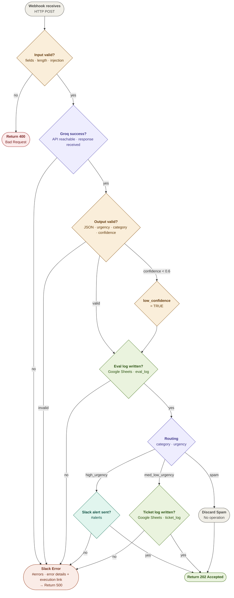

# Flowchart — Complete (All Paths) v2 — Decision-focused

```mermaid
%%{init: {'flowchart': {'rankSpacing': 60, 'nodeSpacing': 40}}}%%
flowchart TD
    start(["`**Webhook receives**
    HTTP POST`"])

    start --> d_input{"`**Input valid?**
    fields · length · injection`"}

    d_input -->|no| end_reject(["`**Return 400**
    Bad Request`"])

    d_input -->|yes| d_groq{"`**Groq success?**
    API reachable · response received`"}

    d_groq -->|no| slack_error

    d_groq -->|yes| d_output{"`**Output valid?**
    JSON · urgency · category · confidence`"}

    d_output -->|invalid| slack_error

    d_output -->|confidence < 0.6| flag{"`**low_confidence**
    = TRUE`"}

    d_output -->|valid| eval_log_ok

    flag --> eval_log_ok

    eval_log_ok{"`**Eval log written?**
    Google Sheets · eval_log`"}

    eval_log_ok -->|no| slack_error

    eval_log_ok -->|yes| d_routing{"`**Routing**
    category · urgency`"}

    d_routing -->|spam| end_spam(["`**Discard Spam**
    No operation`"])

    d_routing -->|high_urgency| d_slack{"`**Slack alert sent?**
    #alerts`"}

    d_routing -->|med_low_urgency| d_sheets{"`**Ticket log written?**
    Google Sheets · ticket_log`"}

    d_slack -->|no| slack_error
    d_slack -->|yes| end_ok(["`**Return 202 Accepted**`"])

    d_sheets -->|no| slack_error
    d_sheets -->|yes| end_ok

    end_spam --> end_ok

    slack_error(["`**Slack Error**
    #errors · error details + execution link
    → Return 500`"])

    style start fill:#F1EFE8,stroke:#5F5E5A,color:#444441
    style d_input fill:#FAEEDA,stroke:#854F0B,color:#633806
    style d_groq fill:#EEEDFE,stroke:#534AB7,color:#3C3489
    style d_output fill:#FAEEDA,stroke:#854F0B,color:#633806
    style flag fill:#FAEEDA,stroke:#854F0B,color:#633806
    style eval_log_ok fill:#EAF3DE,stroke:#3B6D11,color:#27500A
    style d_routing fill:#EEEDFE,stroke:#534AB7,color:#3C3489
    style d_slack fill:#E1F5EE,stroke:#0F6E56,color:#085041
    style d_sheets fill:#EAF3DE,stroke:#3B6D11,color:#27500A
    style slack_error fill:#FAECE7,stroke:#993C1D,color:#712B13
    style end_reject fill:#FCEBEB,stroke:#A32D2D,color:#791F1F
    style end_spam fill:#F1EFE8,stroke:#5F5E5A,color:#444441
    style end_ok fill:#EAF3DE,stroke:#3B6D11,color:#27500A
```
