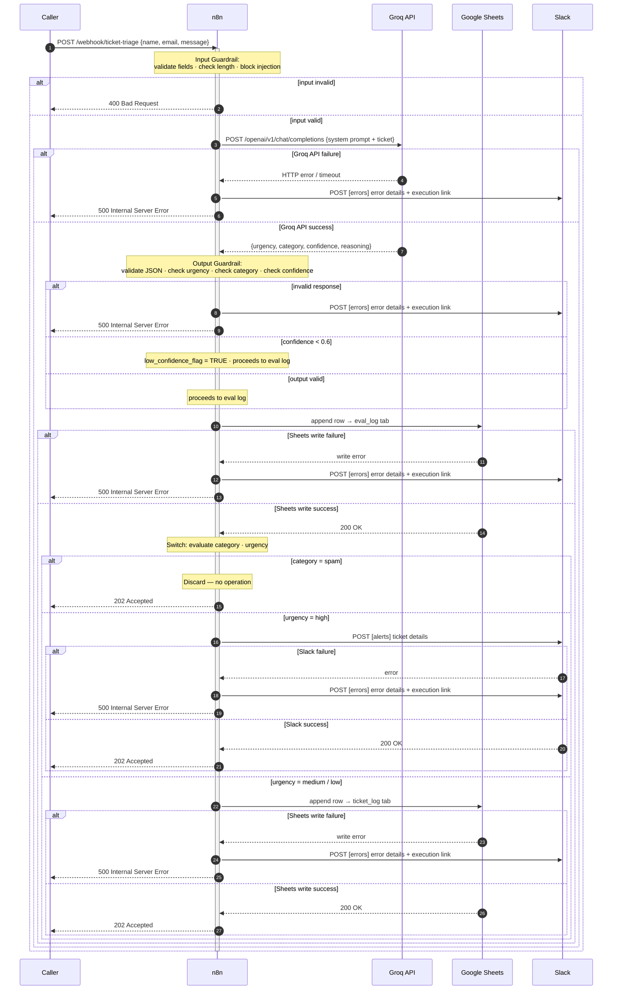

# Sequence Diagram — AI-Powered Support Ticket Triage

```mermaid
sequenceDiagram
    autonumber
    participant C as Caller
    participant N as n8n
    participant G as Groq API
    participant S as Google Sheets
    participant SL as Slack

    C->>N: POST /webhook/ticket-triage {name, email, message}
    activate N

    Note over N: Input Guardrail:<br/>validate fields · check length · block injection

    alt input invalid
        N-->>C: 400 Bad Request
    else input valid
        N->>G: POST /openai/v1/chat/completions {system prompt + ticket}

        alt Groq API failure
            G-->>N: HTTP error / timeout
            N->>SL: POST [errors] error details + execution link
            N-->>C: 500 Internal Server Error
        else Groq API success
            G-->>N: {urgency, category, confidence, reasoning}

            Note over N: Output Guardrail:<br/>validate JSON · check urgency · check category · check confidence

            alt invalid response
                N->>SL: POST [errors] error details + execution link
                N-->>C: 500 Internal Server Error
            else confidence < 0.6
                Note over N: low_confidence_flag = TRUE · proceeds to eval log
            else output valid
                Note over N: proceeds to eval log
            end

            N->>S: append row → eval_log tab

            alt Sheets write failure
                S-->>N: write error
                N->>SL: POST [errors] error details + execution link
                N-->>C: 500 Internal Server Error
            else Sheets write success
                S-->>N: 200 OK

                Note over N: Switch: evaluate category · urgency

                alt category = spam
                    Note over N: Discard — no operation
                    N-->>C: 202 Accepted
                else urgency = high
                    N->>SL: POST [alerts] ticket details
                    alt Slack failure
                        SL-->>N: error
                        N->>SL: POST [errors] error details + execution link
                        N-->>C: 500 Internal Server Error
                    else Slack success
                        SL-->>N: 200 OK
                        N-->>C: 202 Accepted
                    end
                else urgency = medium / low
                    N->>S: append row → ticket_log tab
                    alt Sheets write failure
                        S-->>N: write error
                        N->>SL: POST [errors] error details + execution link
                        N-->>C: 500 Internal Server Error
                    else Sheets write success
                        S-->>N: 200 OK
                        N-->>C: 202 Accepted
                    end
                end
            end
        end
    end

    deactivate N
```
